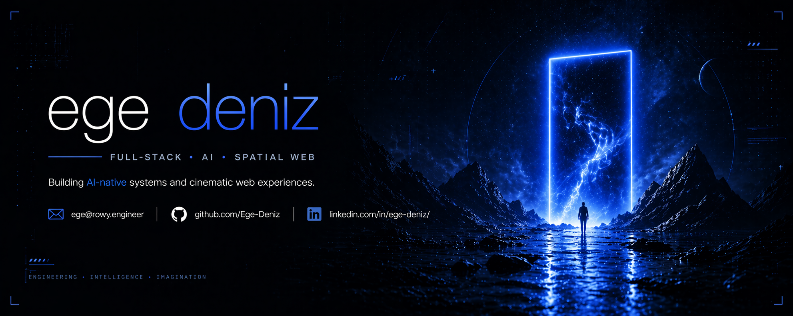

  

 

# Ege Deniz

**Full-stack AI builder. Spatial web, agent systems, and cinematic product surfaces.**

[rowy.engineer](https://rowy.engineer) · [LinkedIn](https://linkedin.com/in/ege-deniz) · [Email](mailto:deadlyrod11@gmail.com)

---

## What I Build

I build AI-native software with a visual edge: local operator systems, agent workflows, second-brain infrastructure, and spatial web experiences that feel closer to product cinema than template UI.

| Focus | Proof |
|---|---|
| **AI-native systems** | Agents, workflow tools, durable Markdown reports, second-brain infrastructure |
| **Spatial web** | Three.js, WebGL, GLSL, particle systems, shader-driven interfaces |
| **Product craft** | Next.js, React, Tailwind, deployable artifacts with tight visual direction |

## Featured Work

**[rowy.engineer](https://rowy.engineer)**

Personal spatial portfolio built around Three.js particle systems, custom GLSL shaders, and cinematic interaction design.

Repo: [Ege-Deniz/personal-hub](https://github.com/Ege-Deniz/personal-hub)

**[zen-archery-for-builders](https://github.com/Ege-Deniz/zen-archery-for-builders)**

A workflow discipline layer for AI-assisted building: cleaner context, fewer repeated corrections, better agent setup.

**[siba-e-motion](https://github.com/Ege-Deniz/siba-e-motion)**

EV dealership site with a progressive enhancement layer, reactive canvas hero overlay, and manifest-driven model switching.

Live: [siba-e-motion.vercel.app](https://siba-e-motion.vercel.app)

## Now Building

**Rowy Operator** - a mission-based local AI operator for brain context, browser QA, patch planning, and durable project reports.

It is the execution layer around my personal knowledge system: read the brain, inspect the workspace, run bounded missions, verify results, and leave evidence behind.

## Stack

TypeScript · React · Next.js · Three.js · WebGL · GLSL · Python · C · Node · Tailwind · Supabase · Codex · Claude Code

---

  Shipping AI systems with spatial taste.

