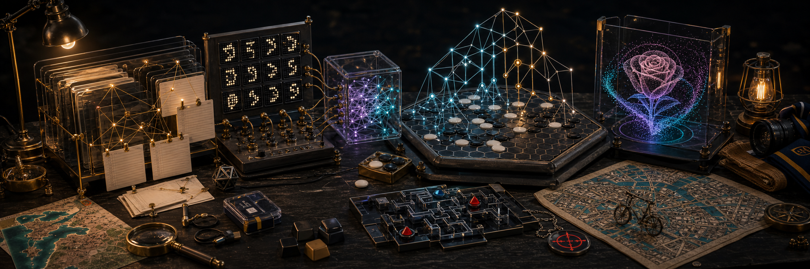

<p align="center">
  
</p>

# Ege Deniz

`AI-native tools` / `spatial web` / `proof artifacts`

I like interfaces that show their work: traces, search trees, reproducible ML, shader surfaces.

Computer Engineering BSc. Competitive archer. Valorant Radiant / CS2 Faceit 10. Cyprus -> Istanbul -> Netherlands.

[rowy.engineer](https://rowy.engineer) / [LinkedIn](https://linkedin.com/in/ege-deniz) / [email](mailto:ege@rowy.engineer)

```text
agent runs       -> trace them
math             -> make it reproducible
interfaces       -> make them move
context          -> keep it honest
shots            -> stop gripping
```

## Bench

- [Brain Operator](https://github.com/Ege-Deniz/brain-operator) - local agent devtools for Obsidian vaults. Trace what Claude/Codex searched, read, cited, missed, changed.
- [Backpropagation, from scratch](https://backprop-public.vercel.app) - 953 lines of C11, 35-10-6 digit classifier, deterministic seed, noise tests, public walkthrough.
- [Zen Archery for Builders](https://github.com/Ege-Deniz/zen-archery-for-builders) - AI-workflow discipline from a former archer. Cleaner context. Fewer repeated corrections.
- MCTS Hex Trace - UCT search on Hex as a scrubbable visual trace.
- [rowy.engineer](https://rowy.engineer) - spatial portfolio surface. Shader work, motion, proof objects.

`TypeScript` `React` `Next.js` `Three.js` `R3F` `WebGL` `GLSL` `Python` `C` `Node` `Bun` `Postgres` `Supabase` `Obsidian` `Claude Code` `Codex`
